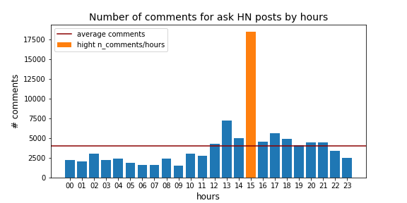

# Reddit_post

The dataset is a set of Reddit post from 06.09.15 to 26.09.16. 

The analysis focused on the Hackers News (HN) post: **Ask HN** and **Post HN** which represent only a small fraction of the dataset (see fig below). 

## When do the people publish posts
### Ask HN Post 

Reddit users published their Ask HN posts mostly during the afternoon with a pic betwwen 15-16 (EST time) and a second pic for 18-19. Surprisely, the post created 15-16 receive the hightest number of comments

