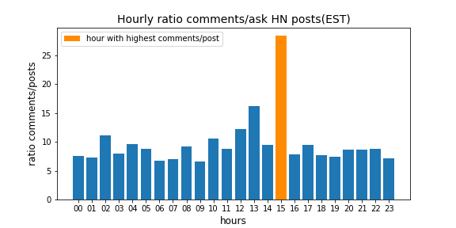
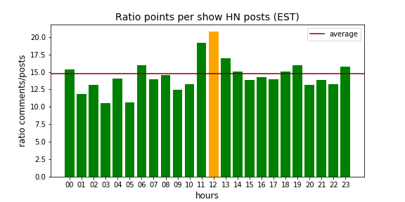

# Reddit_post

The dataset is a set of Reddit post from 06.09.15 to 26.09.16. 

The analysis focused on the Hackers News (HN) post: **Ask HN** and **Post HN** which represent only a small fraction of the dataset (see fig below). 

## Time of publication
#### frequency of publication

Reddit users published their **Ask HN_** posts mostly during the afternoon with a pic betwwen 15-16 (EST time) and it is a similar trend for the **Show HN** posts.

#### Hourly ratio comments/post
The **Ask HN** posts created between 15-16 are the ones receive the hightest average number of comments per hours. This contrast is less pronounce for  **Show HN** posts with a maximum between 12 and 13.

#### hourly ratio points/post
In average, a  **Ask HN** post 11.26 points and a ***Show HN** post gets 14.78 points

The trend is similar to what is observed with the number of comments/posts, high contrast in **Ask HN** posts and more diffuse for **Show HN** posts.

#### Conclusion
The time dimension is more important for **Ask HN** posts if one wants to optimize the number of comments and points.
Also, 1500 EST corresponds to the evenings hours (8PM UTC), hence the step increase could be due to Europe population but we do not have that information for confirmation. 

