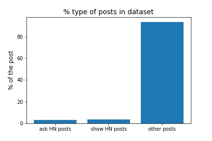

# Reddit_post

The dataset is a set of Reddit post from 06.09.15 to 26.09.16. 

The analysis focused on the Hackers News (HN) post: **Ask HN** and **Post HN** which represent only a small fraction of the dataset (see fig below). 

## Time of publication
#### frequency of publication

Reddit users published their **Ask HN_** posts mostly during the afternoon with a pic betwwen 15-16 (EST time) and it is a similar trend for the **Show HN** posts.

#### hourly ratio comments/posts
The **Ask HN** posts created between 15-16 are the ones receive the hightest average number of comments per hours. This tendency is not found for the **Show HN** posts. 

#### hourly points
In average, a  **Ask HN** post 11.26 points and a ***Show HN** post gets 14.78 points

A similar trend 

